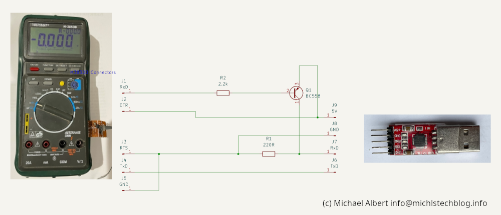

#  Metex / Voltcraft Projects

## Project 1: A simple powershell library to read values from the multimeter

Usage of the library:
Source the library
```powershell
. .\libmetex.ps1
```
Create a new instance
```powershell
$Metex=new-object MetexM3850D("COM5")
```
Open the COM Port 
```powershell
$Metex.Open()
```
Read Measures
```powershell
$Metex.ReadMeasureSynchron()
$MeasureResult=$Metex.ReadMeasureSynchron()
```
Output should be something like this
```
MeasuringUnit    : Diode
Value            : 0
RawMeasureString : DI    OL   mV
Result           : Overload
Unit             : V
RawValue         : OL
RawUnit          : mV

MeasuringUnit    : Capacity
Value            : 4E-12
RawMeasureString : CA  0.004  nF
Result           : OK
Unit             : F
RawValue         : 0.004
RawUnit          : nF

MeasuringUnit    : CurrentDC
Value            : -1E-07
RawMeasureString : DC -000.1  uA
Result           : OK
Unit             : A
RawValue         : -000.1
RawUnit          : uA
```
Close the COM Port 
```powershell
$Metex.Close()
```

## Project 2: An adapter to connect a multimeter by a UART to USB Converter (CB2102) to a PC
The Kicad project is a simple convert to connect to M3850D to a TTL UART to USB Converter

The Serial port of the Multimeter:

 
RxD and TxD Ports are MAX232 compatible. Means -12V = High and +12V is Low Level. 

Therefore the ports must be inverted (done by Transistor Q1) to deal with a TTL USB adapter. This is only necessary for RxD because to start a measurement read, only a falling rise at TxD port is requiered, indepentend which character is send to the multimeter.

The multimeter serial port is isolated by optocouplers from the multimeter. A supply voltage is needed. 

DTR and RTS Ports are just used for the power supply of the optocouplers not for a serial handshake.

In my test a 5V supply is sufficent. RTS=GND DTR=5V

This is the schmetic:



 
